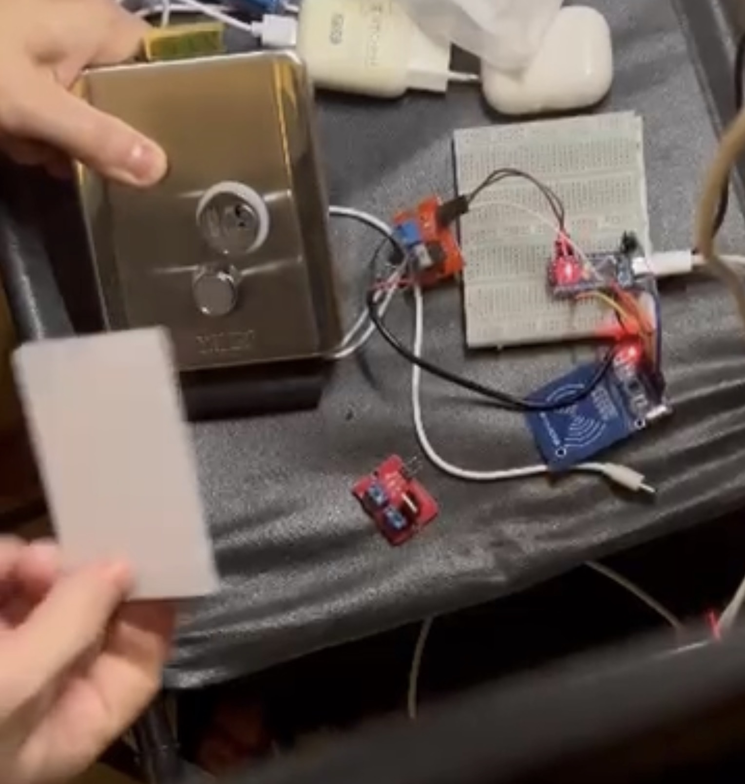

## 📌 Содержание
- [Особенности](/особенности.md)
- [Необходимые компоненты (BOM)](/необходимые-компоненты.md)
- [Подключение / Схема](/подключение--схема.md)
- [Настройка программного обеспечения](/настройка-программного-обеспечения)
- ___
- ### 🎥 Демонстрация работы RFID-замка

---