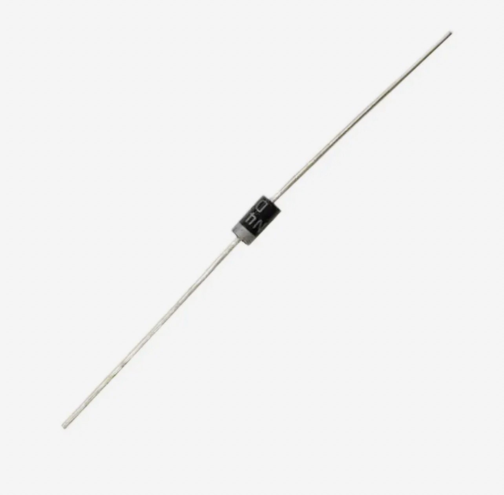

[Назад](/README.md)
___
> ⚠️ **Внимание: питание RFID-модуля**
>
> Модуль **RC522** работает **только от 3.3 V**.  
> Подключение питания **5 V приведёт к его повреждению**.  
> 
> Хотя цифровые линии SPI (MOSI, MISO, SCK, SDA) Arduino Nano имеют 5 V-логику,  
> большинство модулей RC522 уже оснащены встроенными резисторами, которые частично защищают от 5 V.  
> Однако, если ваш модуль **без уровневых преобразователей**, рекомендуется:
> - использовать **резистивный делитель** на линии SDA (SS) и MOSI;
> - либо применить **уровневый конвертер 5V ↔ 3.3V**.
>
> ✅ Безопасно: **3.3 V питание**, общая **GND**, и аккуратная работа с линиями SPI.

---

> ⚙️ **Примечание по MOSFET и защите замка**
>
> Если вы управляете **реле** или **электромагнитным замком** через MOSFET (например, IRF520),  
> обязательно установите **обратный защитный диод** (например, `1N4007`) **параллельно катушке нагрузки**.
>
> Диод подключается в **обратной полярности**:
> ```
> +5V ──────┬───────────────┐
>            │               │
>         [ Катушка реле ]  |<| 1N4007
>            │               │
>            └───[ MOSFET DRAIN ]─── MOSFET SOURCE → GND
> ```
>
> Это защитит MOSFET и Arduino от выбросов напряжения, возникающих при размыкании катушки.
>
> 💡 **Совет:** MOSFET **IRF520** не полностью открывается при 5 V.  

---
[Назад](/README.md)