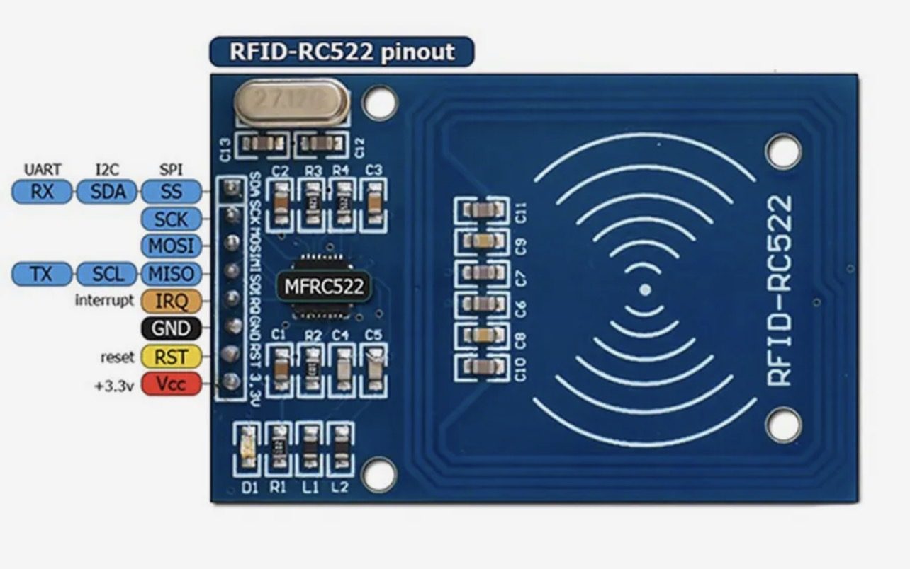

[Назад](/README.md)
___

### 🔌 Подключение / Схема
|Arduino Nano пины | пины RC522 |
|--------|------|
|D10     |SDA   |
|D13     |SCK   |
|D11     |MOSI  |
|D12     |MISO  |
|GND     |GND   |
|D9      |RST   |
|3.3V    |3.3V  |
___

### 🔌 Подключение / Схема
|Arduino Nano пины | пины MOSFET IRF520|
|--------|------|
|D7      |SIG   |
|5V      |VCC   |
|GND     |GND   |
___
[Назад](/README.md)